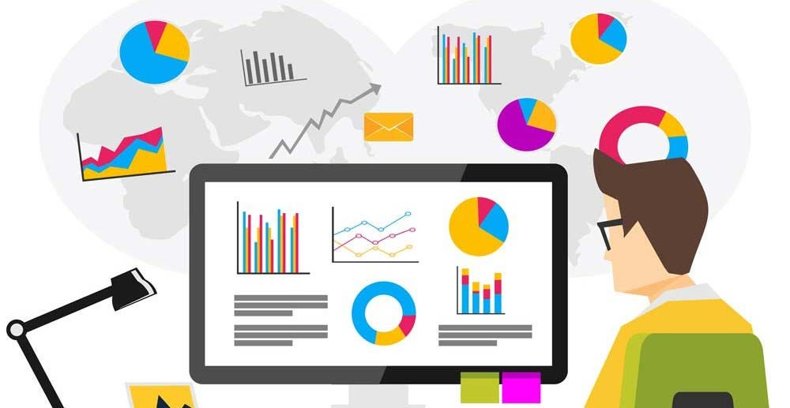

  

    <h2 align="left">
      <abc>
        Hi there 👋 
         
        I'm Seshi Reddy Syamala 
        Data Enthusiast 
          

  
  

      </abc>
    </h2>
  

<h2 align="left">👨🏻‍💻 About Me:</h2>

- :bar_chart: Passionate Data Analyst
- :mortar_board: Pursuing a Master's in Business Analytics and Information Systems
- :chart_with_upwards_trend: Expertise in data analysis and visualization
- :gear: Proficient in data visualization tools like **Power BI** and **Tableau**
- :bar_chart: Skilled in creating interactive dashboards and insightful visualizations
- :rocket: Excited about uncovering insights and patterns in data to drive decision-making
- :zap: Fun fact: I love attending conferences to network and learn 

<h2 align="left">:heart: Let's get connected:</h2>

<!--
**Seshireddysyamala/Seshireddysyamala** is a ✨ _special_ ✨ repository because its `README.md` (this file) appears on your GitHub profile.

Here are some ideas to get you started:

- 🔭 I’m currently working on ...
- 🌱 I’m currently learning ...
- 👯 I’m looking to collaborate on ...
- 🤔 I’m looking for help with ...
- 💬 Ask me about ...
- 📫 How to reach me: ...
- 😄 Pronouns: ...
- ⚡ Fun fact: ...
-->
